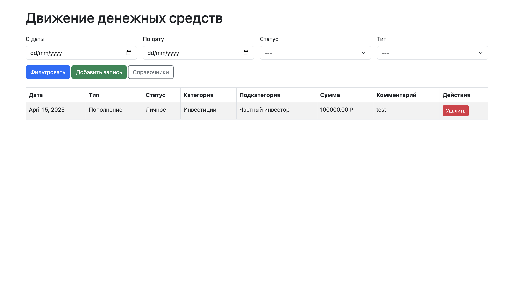
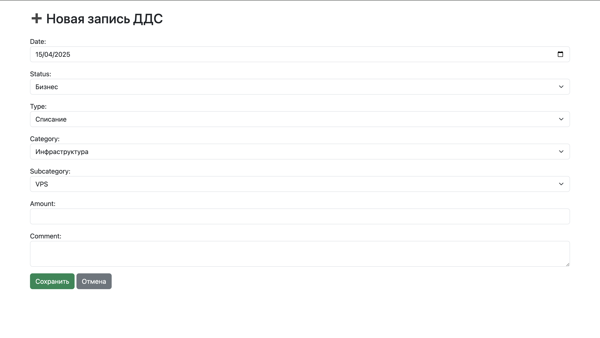

Finance Tracker — Тестовое задание (backend-разработчик)

Проект представляет собой веб-приложение для учёта движения денежных средств с возможностью фильтрации, управления справочниками и работы через REST API.

---

## Функциональность

### 📥 Добавление записей
- Через веб-интерфейс (`/add/`)
- Через DRF-интерфейс (`/api/entries/`)
- Доступные поля: сумма, дата, статус, тип, категория, подкатегория, комментарий

### Просмотр и фильтрация записей
- Главная страница `/`
- Фильтры: по дате, типу и статусу
- Суммы отображаются с символом ₽
- Кнопка удаления с подтверждением

### Управление справочниками `/manage/`
- Добавление, редактирование и удаление:
  - Типов
  - Статусов
  - Категорий (привязка к типу)
  - Подкатегорий (привязка к категории)
- Всё реализовано через UI без использования Django admin

### API
- Подключён `Django REST Framework`
- Swagger-документация: `/api/docs/`
- Эндпоинты:
  - `/api/entries/`
  - `/api/types/`
  - `/api/statuses/`
  - `/api/categories/`
  - `/api/subcategories/`

---

## Скриншоты

### Главная страница


### Добавление записи


### Управление справочниками


---

## Установка

```bash
git clone https://github.com/alexandershukurov/finance-tracker.git
cd finance-tracker
pip install -r requirements.txt
python manage.py migrate
python manage.py loaddata fixtures.json
python manage.py runserver